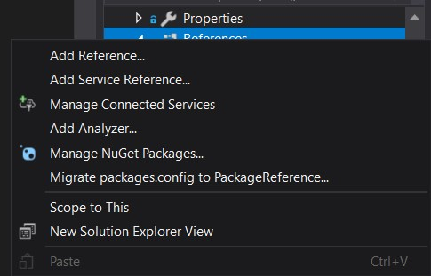
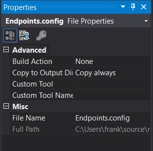
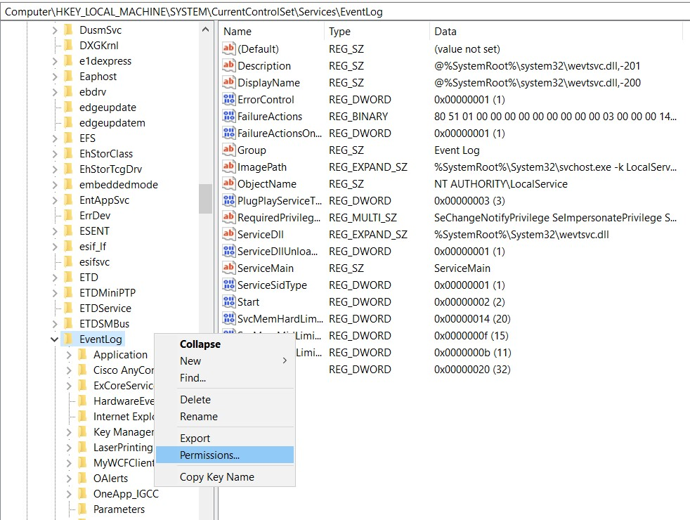
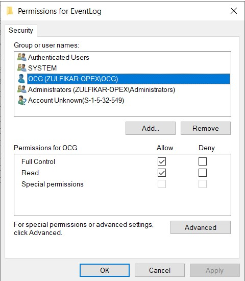
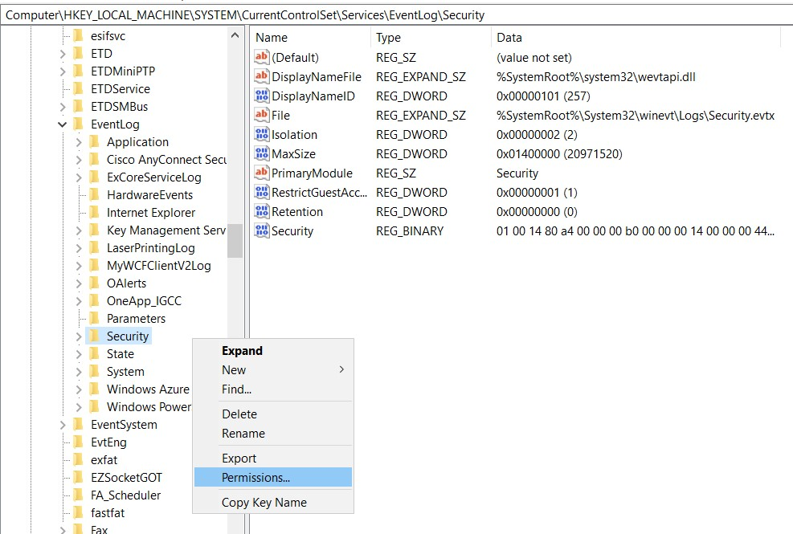
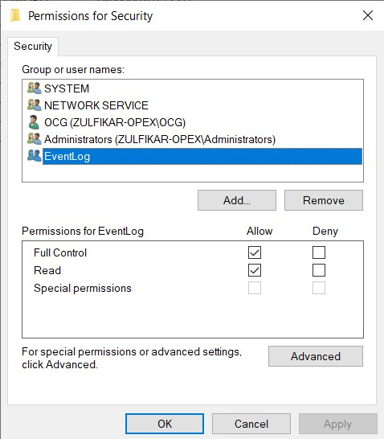

# How to use the library `.dll`
## Add reference `.dll` in your project:
- Camstar.Exceptions.dll
- Camstar.Util.dll
- Camstar.WCFClient.dll
- Camstar.WCFClientBase.dll
- InSiteXMLClient.dll
- OpcenterWikLibrary.dll </br></br>



## Replace `App.config`
Rename `App.config.example` to `App.config` and changes your configuration inside there. Notes: **Password is used Encrypted String**

## Copy `Endpoints.config`
Copy `Endpoints.config` into your project. and make properties Copy to Output = Copy always. </br></br>


Edit all URL inside `Endpoints.config` based on the `Opcenter Server`, for example:
```
https://excr86mio40/CamstarWCFServices/QueryService.svc

to

https://<your mes server>/CamstarWCFServices/QueryService.svc
```

# Add Assembly Name in `Program.cs`
This is very **important** steps!
Add syntax below in your `Program.cs` inside `static void Main(string[] args){}`
```C#
AppSettings.AssemblyName = System.Reflection.Assembly.GetExecutingAssembly().GetName().Name;
```
For Example
```C#
using System;
using System.Collections.Generic;
using System.Linq;
using System.Threading.Tasks;
using System.Windows.Forms;

namespace LaserPrinting
{
    static class Program
    {
        [STAThread]
        static void Main()
        {
            AppSettings.AssemblyName = System.Reflection.Assembly.GetExecutingAssembly().GetName().Name; // This one, add in your project !!!
            Application.EnableVisualStyles();
            Application.SetCompatibleTextRenderingDefault(false);
            Application.Run(new Main());
        }
    }
}

```

# Enabled Event Log on windows Machine
- Log on to the computer as an administrator.
- Click Start, click Run, type Regedit in the Open box, and then click OK. - The Registry Editor window appears.
- Locate the following registry subkey
```
Computer\HKEY_LOCAL_MACHINE\SYSTEM\CurrentControlSet\Services\EventLog
```
- Right-click Eventlog, and then click Permissions. The Permissions for Eventlog dialog box appears.



- Click Add, add the user account or group that you want and set the following permissions: `Full Control`.



- Locate the following registry subkey
```
Computer\HKEY_LOCAL_MACHINE\SYSTEM\CurrentControlSet\Services\EventLog\Security
```



- Click Add, add the user account or group that you want and set the following permissions: `Full Control`.



# Documentation API
- [Service Util API](./ServiceUtil.md)

# License & Copy Right
© M. Zulfikar Isnaen [MIT License](LICENSE).