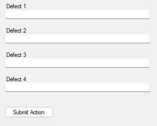

# Service Util **API**

## REUSABLE FUNCTION

<details>
<summary><b>1. ProcessResult</b></summary>
This function is used for check the Result of ServiceTransaction MES success or not, this function will return boolean (success/not success) and return string text.

**Usage example**
```C#
string sMessage = "";
MoveInService oService = null;
MoveIn oServiceObject = null;
ResultStatus oResulstStatus = null;
oService = new MoveInService(AppSettings.ExCoreUserProfile);
oServiceObject = new MoveIn() { Container = new ContainerRef(ContainerName) };
oResultStatus = oService.ExecuteTransaction(oServiceObject);
bool statusMoveIn = ProcessResult(oResultStatus, ref sMessage, false);
```
**API**
```C#
bool ProcessResult(ResultStatus Result, ref string ResultMessage, bool IgnoreException = true)
```
</details>

<details>
<summary><b>2. ObjectExists</b></summary>
This function is usedfor check whether certain object is exists or not

**Usage example**
```C#
MfgOrderMaintService oService = null;
MfgOrderMaint oServiceObject = null;
//check object exists
oService = new MfgOrderMaintService(AppSettings.ExCoreUserProfile);
bool bObjectExists = ObjectExists(oService, new MfgOrderMaint(), Name);
// Prepare Object
oServiceObject = new MfgOrderMaint();
if (bObjectExists)
{
    oServiceObject.ObjectToChange = new NamedObjectRef(Name);
    oService.BeginTransaction();
    oService.Load(oServiceObject);
}
```
**API**
```C#
bool ObjectExists(dynamic ServiceRef, dynamic ServiceObject, string Name)
```
</details>

<details>
<summary><b>3. ObjectExists(revision)</b></summary>
This function is usedfor check whether certain object revision is exists or not

**Usage example**
```C#
ProductMaintService oService = null;
ProductMaint oServiceObject = null;
//check object exists
oService = new ProductMaintService(AppSettings.ExCoreUserProfile);
bool bObjectExists = ObjectExists(oService, new ProductMaint(), Name, Revision);
// Prepare Object
oServiceObject = new ProductMaint();
if (bObjectExists)
{
    oServiceObject.ObjectToChange = new RevisionObjectRef(Name);
    oService.BeginTransaction();
    oService.Load(oServiceObject);
}
```
**API**
```C#
bool ObjectExists(dynamic ServiceRef, dynamic ServiceObject, string Name, string Revision)
```
</details>

<details>
<summary><b>4. GetDataPointSummaryRef</b></summary>
This function is used for get the objects of the DataCollection, so if we don't know the name of Data Collection, we can used this function to get automatically the DataCollectionDef Object Automatically.

**Usage example**
```C#
string DataCollectionName = "";
string DataCollectionRev = "";
MoveInService oService = null;
MoveIn oServiceObject = null;
oService = new MoveInService(AppSettings.ExCoreUserProfile);
DataPointSummary oDataPointSummaryRef = GetDataPointSummaryRef(oService, oServiceObject, new MoveIn_Request(), new MoveIn_Info(), ref DataCollectionName, ref DataCollectionRev);
```
**API**
```C#
DataPointSummary GetDataPointSummaryRef(dynamic Service, dynamic ServiceObject, dynamic ServiceObject_Request, dynamic ServiceObject_Info, ref string DataCollectionName, ref string DataCollectionRev)
```
</details>

<details>
<summary><b>5. SetDataPointSummary(DataPointSummaryRef)</b></summary>
This function for set the object data collection, this function commonly is combined with GetDataPointSummaryRef

**Usage example**
```C#
string DataCollectionName = "";
string DataCollectionRev = "";
MoveInService oService = null;
MoveIn oServiceObject = null;
oService = new MoveInService(AppSettings.ExCoreUserProfile);
DataPointSummary oDataPointSummaryRef = GetDataPointSummaryRef(oService, oServiceObject, new MoveIn_Request(), new MoveIn_Info(), ref DataCollectionName, ref DataCollectionRev);
oServiceObject.ParametricData = SetDataPointSummary(oDataPointSummaryRef, DataPoints);
```
**API**
```C#
DataPointSummary SetDataPointSummary(DataPointSummary DataPointSummaryRef, DataPointDetails[] DataPoints)
```
</details>

<details>
<summary><b>6. SetDataPointSummary( DataPointCollectionRef)</b></summary>
This function for set the object data collection

**Usage example**
```C#
string DataCollectionName = "";
string DataCollectionRev = "";
MoveInService oService = null;
MoveIn oServiceObject = null;
oService = new MoveInService(AppSettings.ExCoreUserProfile);
oServiceObject.DataCollectionDef = new RevisionedObjectRef() { Name = DataCollectionName, Revision = DataCollectionRev, RevisionOfRecord = (DataCollectionRev == "") };
oServiceObject.ParametricData = SetDataPointSummary(oServiceObject.DataCollectionDef, DataPoints);
```
**API**
```C#
DataPointSummary SetDataPointSummary(object DataCollectionRef, DataPointDetails[] DataPoints)
```
</details>

<details>
<summary><b>7. IsDate</b></summary>
This function for set the object data collection

**Usage example**
```C#
ServiceUtil oServiceUtil = new ServiceUtil();
bool result = oServiceUtil.IsDate("05/29/2015 05:50 AM");
```
**API**
```C#
bool IsDate(string input)
```
</details>

<details>
<summary><b>8. CanConvertTo</b></summary>
This function for check whether the String can convert to double or not

**Usage example**
```C#
ServiceUtil oServiceUtil = new ServiceUtil();
if (oServiceUtil.CanCovertTo("3", "System.Double"))
{
    MessageBox.Show("Can!");
}
else
{
    MessageBox.Show("Can't!");
}
```
**API**
```C#
bool CanCovertTo(string testString, string testType)
```
</details>


## MAINTENANCE FUNCTION

<details>
<summary><b>1. GetProduct</b></summary>
This function is used for Get the details product from certain String product name

**Usage example**
```C#
ServiceUtil oServiceUtil = new ServiceUtil();
ProductChanges oProduct = GetProduct("Name Product");
```
**API**
```C#
ProductChanges GetProduct(string ProductName, string ProductRevision = "", bool IgnoreException = true)
```
</details>

<details>
<summary><b>2. GetImage</b></summary>
This function is used when we want to getting the Details of Image that available on MES Opcenter

**Usage example**
```C#
isImageChanges oImage = oServiceUtil.GetImage('Name of Document');
if (oImage != null)
{
    pictureBox1.Load(oImage.Identifier.ToString());
}
```
**API**
```C#
public isImageChanges GetImage(string Image, string ImageRevision = "", bool IgnoreException = true)
```
</details>

<details>
<summary><b>3. DocumentChanges</b></summary>
This function is used to get the details of Document

**Usage example**
```C#
DocumentChanges oDocument = oServiceUtil.GetDocument('Name of Document');
if (oDocument != null)
{
    axAcroPDF1.src = oDocument.Identifier.ToString();
}
```
**API**
```C#
public DocumentChanges GetDocument(string Document, string DocumentRevision = "", bool IgnoreException = true)
```
</details>

<details>
<summary><b>4. DocumentSetChanges</b></summary>
This function is used to get the details of Document set, document set is collection of document

**Usage example**
```C#
DocumentSetChanges oDocumentSet = oServiceUtil.GetDocumentSet("Name of Document Set");
if (oDocumentSet != null)
{
    if (oDocumentSet.DocumentEntries.Length > 0)
    {
        DocumentChanges oDocument = oServiceUtil.GetDocument(oDocumentSet.DocumentEntries[0].Document.Name);
        if (oDocument != null)
        {
            axAcroPDF1.src = oDocument.Identifier.ToString();
        }
    }
}
```
**API**
```C#
public DocumentSetChanges GetDocumentSet(string DocumentSetName, bool IgnoreException = true)
```
</details>

<details>
<summary><b>5. GetWorkflow</b></summary>
This function is used for Get the details Workflow from certain String Workflow name

**Usage example**
```C#
ServiceUtil oServiceUtil = new ServiceUtil();
WorkflowChanges oWorkflow = oServiceUtil.GetWorkflow("Name Workflow");
```
**API**
```C#
WorkflowChanges GetWorkflow(string WorkflowName, string WorkflowRevision = "", bool IgnoreException = true)
```
</details>

<details>
<summary><b>6. GetReworkPath</b></summary>
This function is used for getting the list of path rework within container

**Usage example**
```C#
string[] listDataCollectionName = new string[] { "Laser Marking Minime", "Pump & PCBA Assy Minime", "HI-POT Minime", "FCT Minime", "Visual Checking Minime", "Backend Minime", "Laser Marking Ariel", "Pump & PCBA Assy Ariel", "HI-POT Ariel", "FCT Ariel", "Visual Checking Ariel", "Backend Ariel" };
ReworkPathChanges[] oStepRework = oServiceUtil.GetReworkPath("Minime Workflow", "testing-1", listDataCollectionName);
```
**API**
```C#
public ReworkPathChanges[] GetReworkPath(string WorkflowName, string ContainerName, string[] listDataCollectionName, string WorkflowRevision = "", bool IgnoreException = true)
```
</details>

<details>
<summary><b>7. GetReworkPath</b></summary>
This function is used for getting the list of path rework, **(Override Method)**

**Usage example**
```C#
StepChanges[] oStepRework = oServiceUtil.GetReworkPath("Minime Workflow");
```
**API**
```C#
public StepChanges[] GetReworkPath(string WorkflowName, string WorkflowRevision = "", bool IgnoreException = true)
```
</details>


<details>
<summary><b>8. GetERPRouteFromMfgOrder</b></summary>
This function is used for Get ERP Route from certain string Mfg Order name

**Usage example**
```C#
ServiceUtil oServiceUtil = new ServiceUtil();
ERPRouteChanges oERPRoute = oServiceUtil.GetERPRouteFromMfgOrder("Name Mfg Order");
```
**API**
```C#
ERPRouteChanges GetERPRouteFromMfgOrder(MfgOrderChanges oMfgOrder, bool IgnoreException = true)
```
</details>

<details>
<summary><b>9. GetERPRoute</b></summary>
This function is used for Get the details ERP Route from certain String ERP Route name

**Usage example**
```C#
ServiceUtil oServiceUtil = new ServiceUtil();
ERPRouteChanges oERPRoute = GetERPRoute("ERP Route Name");
```
**API**
```C#
ERPRouteChanges GetERPRoute(string ERPRouteName, string ERPRouteRevision = "", bool IgnoreException = true)
```
</details>

<details>
<summary><b>10. GetMfgOrder</b></summary>
This function is used for Get the details Mfg Order from certain String Mfg Order name

**Usage example**
```C#
MfgOrderChanges getMfgOrder = oServiceUtil.GetMfgOrder("Mfg Order Name");
```
**API**
```C#
MfgOrderChanges GetMfgOrder(string MfgOrderName, bool IgnoreException = true)
```
</details>

<details>
<summary><b>11. GetListMfgOrder</b></summary>
This function is used for Get all the list of Mfg Order

**Usage example**
```C#
ServiceUtil oServiceUtil = new ServiceUtil();
List<MfgOrderChanges> oMfgList = new List<MfgOrderChanges>();
```
**API**
```C#
NamedObjectRef[] GetListMfgOrder(bool IgnoreException = true)
```
</details>

<details>
<summary><b>12. GetFinishGoodRecord</b></summary>
This function is used for Getting all the record Container within the Mfg Order. And this function must be used Asynchronous method, otherwise will freeze your application.

**Usage example**
```C#
private Task<CurrentContainerStatus[]> hasil = null;

private string[] listDataCollectionName = new string[] { "Laser Marking Minime", "Pump & PCBA Assy Minime", "HI-POT Minime", "FCT Minime", "Visual Checking Minime", "Backend Minime", "Laser Marking Ariel", "Pump & PCBA Assy Ariel", "HI-POT Ariel", "FCT Ariel", "Visual Checking Ariel", "Backend Ariel" };

private async Task<CurrentContainerStatus[]> myFunc()
{
    ServiceUtil oServiceUtil = new ServiceUtil();
    var myTask = Task.Run(() => oServiceUtil.GetFinishGoodRecord("1936129", listDataCollectionName));
    return await myTask;
}

private void Yours_Event_Click(object sender, EventArgs e)
{
    this.hasil = myFunc();
}
```
**API**
```C#
CurrentContainerStatus[] GetFinishGoodRecord(string MfgOrderName, string[] listDataCollectionName, bool IgnoreException = true)
```
</details>

<details>
<summary><b>13. GetCounterFromMfgOrder</b></summary>
This function is used for counting the unit for specific resource (Unit Counter), and the return is integer.

**Usage example**
```C#
ServiceUtil oServiceUtil = new ServiceUtil();
Camstar.WCF.ObjectStack.wikResourceCounterChanges[] cResourceCounter = new wikResourceCounterChanges[1];
cResourceCounter[0] = new Camstar.WCF.ObjectStack.wikResourceCounterChanges() { Resource = new NamedObjectRef("BW01-NM1-LS"), wikCounterUnit = 1 };
bool result = oServiceUtil.SaveMfgOrder("1936129", "", "", "", "", "", "", 0, null, "", "", "", "", "", cResourceCounter);
if (result)
{
    MfgOrderChanges getMfgOrder = oServiceUtil.GetMfgOrder("1936129");
    MessageBox.Show("Success updated!" + " The Total is: " + oServiceUtil.GetCounterFromMfgOrder(getMfgOrder, "BW01-NM1-LS"));
}
```
**API**
```C#
int GetCounterFromMfgOrder(string MfgOrderName, string ResourceName, bool IgnoreException = true)
```
</details>

<details>
<summary><b>14. SaveMfgOrder</b></summary>
This function is used for Save a Mfg Order with several parameters

**Usage example**
```C#
ServiceUtil oServiceUtil = new ServiceUtil();
bool result = oServiceUtil.SaveMfgOrder("Mfg Order Name", "", "", "Product Name", "", "", "", 1000, null, "", oServiceUtil.IsDate("20/01/2021") == true ? "20/01/2021" : "", oServiceUtil.IsDate("20/02/2021") == true ? "20/02/2021" : "", "", "Released", null, "", "", true);
```
**API**
```C#
public bool SaveMfgOrder(string Name, string Description = "", string Notes = "", string ProductName = "", string ProductRevision = "", string WorkflowName = "", string WorkflowRevision = "", double Qty = 0, List<dynamic> MaterialList = null, string ERPRoute = "", string PlannedStartDate = "", string PlannedCompletedDate = "", string ReleaseDate = "", string OrderStatus = "", wikResourceCounterChanges[] wikListResourceCounter = null, string OrderType = "", string MfgLine = "", bool AutoCreateQueue = false, bool IgnoreException = true)
```
</details>

<details>
<summary><b>15. SaveProduct</b></summary>
This function for save a Product with several parameters

**Usage example**
```C#
ServiceUtil oServiceUtil = new ServiceUtil();
bool result = oServiceUtil.SaveProduct("70704543", "1", "", "This is a product description", "", "Finish Good")
```
**API**
```C#
bool SaveProduct(string ProductName, string Revision, string IsRevOfRcd = "", string Description = "", string Notes = "", string ProductType = "", string DocumentSet = "", string WorkflowName = "", string WorkflowRevision = "", string BOMName = "", string BOMRevision = "", string ProductFamily = "", string Procurement = "", string StartUOM = "", double StartQty = 0, bool IgnoreException = true)
```
</details>

<details>
<summary><b>16. SaveManageQueue</b></summary>
This function is used for save some material into certain queue, the list material is used `List<dynamic>`

**Usage example**
```C#
List<dynamic> cMaterialQueueDetails = new List<dynamic>();
cMaterialQueueDetails.Add(new isMaterialQueueDetailsChanges() { isProduct = new RevisionedObjectRef("Name Product"), isQty = 100, isQtyAvailable = 100, isUOM = new NamedObjectRef("Unit"), isRemovalStrategy = isRemovalStrategyEnum.FIFO, isSequence = 0, isConsumedQty = 0, isInventoryLocation = new NamedObjectRef(AppSettings.DefaultInventoryLocation) });
resultQueue = oServiceUtil.SaveManageQueue("Name Queue", "Name Mfg Order", cMaterialQueueDetails);
```
**API**
```C#
bool SaveManageQueue(string oQueue, string oMfgOrder = "", List<dynamic> MaterialQueueDetails = null, bool isActive = true, bool IgnoreException = true)
```
</details>

<details>
<summary><b>17. SaveManageInventory</b></summary>
This function is used for save single material into certain queue

**Usage example**
```C#
ServiceUtil oServiceUtil = new ServiceUtil();
if (oServiceUtil.SaveManageInventory("Mfg Order 1", "Default", "0310103600", "0310103600", 10000, "EA"))
{
    MessageBox.Show(oServiceUtil.LastResultMessage);
}
```
**API**
```C#
bool SaveManageInventory(string NameMaterialQueue, string ManageInventory, string ProductNumber, string BatchNumber = "", double Qty = 0, string UOM = "", bool IgnoreException = true)
```
</details>

<details>
<summary><b>18. SaveProductType</b></summary>
This function is used for save product Type

**Usage example**
```C#
ServiceUtil oServiceUtil = new ServiceUtil();
if (oServiceUtil.SaveProductType("Finish Good", "This is Type Finish Good"))
{
    MessageBox.Show(oServiceUtil.LastResultMessage);
}
```
**API**
```C#
bool SaveProductType(string Name, string Description = "", bool IgnoreException = true)
```
</details>

<details>
<summary><b>19. SaveProductFamily</b></summary>
This function is used for save product Family

**Usage example**
```C#
ServiceUtil oServiceUtil = new ServiceUtil();
if (oServiceUtil.SaveProductFamily("135", "PCB Assy"))
{
    MessageBox.Show(oServiceUtil.LastResultMessage);
}
```
**API**
```C#
bool SaveProductFamily(string Name, string Description = "", string WorkflowName = "", string WorkflowRevision = "", string DocumentSet = "", string ContainerNumberingRule = "", bool IgnoreException = true)
```
</details>

<details>
<summary><b>20. SaveUOM</b></summary>
This function is used for save UOM

**Usage example**
```C#
ServiceUtil oServiceUtil = new ServiceUtil();
if (oServiceUtil.SaveUOM("EA", "Each"))
{
    MessageBox.Show(oServiceUtil.LastResultMessage);
}
```
**API**
```C#
bool SaveUOM(string Name, string Description = "", bool IgnoreException = true)
```
</details>

<details>
<summary><b>21. GetReworkReasonGroup</b></summary>
This function is used for getting the details of Rework Reason Group

**Usage example**
```C#
ServiceUtil oServiceUtil = new ServiceUtil();
ReworkReasonGroupChanges groupReasonRework = oServiceUtil.GetReworkReasonGroup();
```
**API**
```C#
ReworkReasonGroupChanges GetReworkReasonGroup(string ReworkReasonGroupName = "Default", bool IgnoreException = true)
```
</details>

<details>
<summary><b>22. GetListReworkReason</b></summary>
This function is used to get all the list of rework reason 

**Usage example**
```C#
ServiceUtil oServiceUtil = new ServiceUtil();
NamedObjectRef[] listReworkReason = oServiceUtil.GetListReworkReason();
```
**API**
```C#
NamedObjectRef[] GetListReworkReason(bool IgnoreException = true)
```
</details>

<details>
<summary><b>23. GetContainerDefectReasonGroup</b></summary>
This function is used to get all the list of  DefectReasonGroupName

**Usage example**
```C#
ServiceUtil oServiceUtil = new ServiceUtil();
ContDefectReasonGroupChanges test = oServiceUtil.GetContainerDefectReasonGroup("ReasonGroupA");
```
**API**
```C#
public ContDefectReasonGroupChanges GetContainerDefectReasonGroup(string DefectReasonGroupName ,bool IgnoreException = true)
```
</details>

<details>
<summary><b>24. GetListContainerDefectReason</b></summary>
This function is used to get all the list of DefectReasonName

**Usage example**
```C#
ServiceUtil oServiceUtil = new ServiceUtil();
NamedObjectRef[] cReasonList = oServiceUtil.GetListContainerDefectReason();
Console.WriteLine(cReasonList);
```
**API**
```C#
public NamedObjectRef[] GetListContainerDefectReason(bool IgnoreException = true)
```
</details>

<details>
<summary><b>25. GetListContainerDefectReasonGroupName</b></summary>
This function is used to get all the list of DefectReasonGroupName

**Usage example**
```C#
ServiceUtil oServiceUtil = new ServiceUtil();
NamedObjectRef[] cListDefectReasonGroupName = oServiceUtil.GetListContainerDefectReasonGroupName();
Console.WriteLine(cListDefectReasonGroupName);
```
**API**
```C#
public NamedObjectRef[] GetListContainerDefectReasonGroupName(bool IgnoreException = true)
```
</details>

<details>
<summary><b>26. SaveRepairActionReason</b></summary>
This function is used create Repair Action Reason

**Usage example**
```C#
ServiceUtil oService = new ServiceUtil();
bool bResult = oService.SaveRepairActionReason("Change Component 2", "Change Component Material 2");
if (bResult)
{
    MessageBox.Show("Success");
}
else
{
    MessageBox.Show("Failed");
}
```
**API**
```C#
public bool SaveRepairActionReason(string Name, string Description = "", bool IgnoreException = true)
```
</details>

<details>
<summary><b>27. GetListRepairActionReason</b></summary>
This function is used to get the list of Repair Action Reason

**Usage example**
```C#
ServiceUtil oService = new ServiceUtil();
NamedObjectRef[] list = oService.GetListRepairActionReason();
Console.WriteLine(list);
```
**API**
```C#
public NamedObjectRef[] GetListRepairActionReason(bool IgnoreException = true)
```
</details>

<details>
<summary><b>28. SaveReworkReason</b></summary>
This function is used to save the rework reason

**Usage example**
```C#
ServiceUtil oServiceUtil = new ServiceUtil();
bool bResult = oServiceUtil.SaveReworkReason("Problem Pump", "There's problem on Pump");
if (bResult)
{
    MessageBox.Show("Success");
}
else
{
    MessageBox.Show("Failed");
}
```
**API**
```C#
public bool SaveReworkReason(string Name, string Description = "", bool IgnoreException = true)
```
</details>

<details>
<summary><b>29. SaveReworkReasonGroup</b></summary>
This function is used to save the rework reason Group with entries

**Usage example**
```C#
 ServiceUtil oServiceUtil = new ServiceUtil();
NamedObjectRef[] obj = new NamedObjectRef[2] { new NamedObjectRef() { Name = "New Rework" }, new NamedObjectRef() { Name = "Test" } };
bool bResult = oServiceUtil.SaveReworkReasonGroup("Default", "", obj);
if (bResult)
{
    MessageBox.Show("Success");
}
else
{
    MessageBox.Show("Failed");
}
```
**API**
```C#
public bool SaveReworkReasonGroup(string Name, string Description = "", NamedObjectRef[] ReworkReasons = null, bool IgnoreException = true)
```
</details>

<details>
<summary><b>30. GetFinishGoodRecordSyncWithServer</b></summary>
This function is used to sync the data Finish Good Record beetwen server and distributed cached

**Usage example**
```C#
private async void Bt_MfgOrder_Click(object sender, EventArgs e)
{
    IFinishGoodRecord[] getSyncDataFromServer = await oService.GetFinishGoodRecordSyncWithServer("10032739", listDataCollectionName, TimeSpan.FromSeconds(60));
}
private string[] listDataCollectionName = new string[] { "Laser Marking Minime", "HI-POT Minime", "FCT Minime", "Visual Checking Minime", "Weighing Minime", "Laser Marking Ariel", "HI-POT Ariel", "FCT Ariel", "Visual Checking Ariel", "Weighing Ariel" };
```
**API**
```C#
public async Task<IFinishGoodRecord[]> GetFinishGoodRecordSyncWithServer(string MfgOrderName, string[] listDataCollectionName, TimeSpan? expireTime = null, bool IgnoreException = true)
```
</details>

<details>
<summary><b>31. UpdateOrCreateFinishGoodRecordToCached</b></summary>
This function is used to Update Or Create 1 Record of Finish Good Record into distributed cached.

**Usage example**
```C#
private async void Bt_MfgOrder_Click(object sender, EventArgs e)
{
    bool data1 = await oService.UpdateOrCreateFinishGoodRecordToCached( "PO123", "Container1", "CP_LS", TimeSpan.FromSeconds(60));
    var data2 = await oService.UpdateOrCreateFinishGoodRecordToCached( "PO123", "Container2", "CP_PPA", TimeSpan.FromSeconds(60));
    bool data3 = await oService.UpdateOrCreateFinishGoodRecordToCached("PO123", "Container1", "CP_BE", TimeSpan.FromSeconds(60));
}
```
**API**
```C#
public async Task<bool> UpdateOrCreateFinishGoodRecordToCached(string MfgOrderName, string ContainerName, string ResourceNameUpdate, TimeSpan? expireTime = null, bool IgnoreException = true)
```
</details>

<details>
<summary><b>32. GetFinishGoodRecordFromCached</b></summary>
This function is used to get record Finish Good Record from distributed cached

**Usage example**
```C#
private async void Bt_MfgOrder_Click(object sender, EventArgs e)
{
    var findMfgOrder = oService.GetMfgOrder("10032739");
    List<string> containerList = new List<string>();
    if (findMfgOrder.Containers != null)
    {
        if (findMfgOrder.Containers.Length > 0)
        {
            foreach (var item in findMfgOrder.Containers)
            {
                containerList.Add(item.ToString());
            }
        }
    }
    var getFromCached = await oService.GetFinishGoodRecordFromCached("10032739", containerList);
    Console.WriteLine(getFromCached);
}
```
**API**
```C#
public async Task<IFinishGoodRecord[]> GetFinishGoodRecordFromCached(string MfgOrderName, List<string> ContainerList, bool IgnoreException = true)
```
</details>

<details>
<summary><b>33. SaveMfgResourceCounterCached</b></summary>
This function is used save number of resource counter to the distributed cached

**Usage example**
```C#
private async void Bt_Counter_Click(object sender, EventArgs e)
{
    string recordId = await oServiceUtil.SaveMfgResourceCounterCached("1946087", "BW01-NM1-LS", 5, TimeSpan.FromSeconds(20));
}
```
**API**
```C#
public async Task<string> SaveMfgResourceCounterCached(string MfgOrderName, string ResourceName, int DataCounter, TimeSpan? expireTime = null, bool IgnoreException = true)
```
</details>

<details>
<summary><b>34. GetMfgResourceCounterCached</b></summary>
This function is used to get the number of resource counter from the distributed cached

**Usage example**
```C#
private async void Bt_Counter_Click(object sender, EventArgs e)
{
    string MfgOrderName = "1946087";
    string ResourceName = "BW01-NM1-LS";
    string recordId = await oServiceUtil.SaveMfgResourceCounterCached("1946087", "BW01-NM1-LS", 5, TimeSpan.FromSeconds(20));
    IResourceCounter data1 = await oServiceUtil.GetMfgResourceCounterCached(recordId);
    IResourceCounter data2 = await oServiceUtil.GetMfgResourceCounterCached(MfgOrderName + ResourceName);
}
```
**API**
```C#
public async Task<ResourceCounter> GetMfgResourceCounterCached(string RecordId, bool IgnoreException = true)
```
</details>

<details>
<summary><b>35. SaveMfgOrderResourceCounter</b></summary>
This function is used to save resource counter to opcenter mfg order, if the resource name counter already exists it will replaced by the new record.

**Usage example**
```C#
private void Bt_Counter_Click(object sender, EventArgs e)
{
    ServiceUtil oServiceUtil = new ServiceUtil();
    Camstar.WCF.ObjectStack.wikResourceCounterChanges[] cResourceCounter = new wikResourceCounterChanges[2];
    MfgOrderChanges MfgOrder = oServiceUtil.GetMfgOrder("TestResourceCounter");
    cResourceCounter[0] = new Camstar.WCF.ObjectStack.wikResourceCounterChanges() { Resource = new NamedObjectRef("BW01-NM1-BE"), wikCounterUnit = 9 };
    cResourceCounter[1] = new Camstar.WCF.ObjectStack.wikResourceCounterChanges() { Resource = new NamedObjectRef("BW01-NM1-VC"), wikCounterUnit = 4 };
    bool result = SaveMfgOrderResourceCounter(cResourceCounter, MfgOrder);
}
```
**API**
```C#
public bool SaveMfgOrderResourceCounter(wikResourceCounterChanges[] wikListResourceCounter, MfgOrderChanges MfgOrder, bool IgnoreException = true)
```
</details>

## CONTAINER TXN FUNCTION

<details>
<summary><b>1. ExecuteRework</b></summary>
This function is used for Executing Rework to the certain Container

**Usage example**
```C#
if (oServiceUtil.ExecuteRework("7070223900-06", "ReasonRework", "Repair", "BW-NM01-R"))
{
    MessageBox.Show(oServiceUtil.LastResultMessage);
}
```
**API**
```C#
bool ExecuteRework(string ContainerName, string ReworkReason, string Path = "", string Resource = "", bool IgnoreException = true)
```
</details>

<details>
<summary><b>2. ExecuteStart</b></summary>
This function is used for Create or Start a Container

**Usage example**
```C#
ServiceUtil oServiceUtil = new ServiceUtil();
if (oServiceUtil.ExecuteStart("7070223900-06", "MfgMinime01", "7070223900", "1", "Minime Workflow", "1", "Unit", "Production", "Normal", "", 100, "Unit", "", "", ""))
{
    MessageBox.Show(oServiceUtil.LastResultMessage);
}
```
**API**
```C#
bool ExecuteStart(string ContainerName, string MfgOrder = "", string ProductName = "", string ProductRevision = "", string WorkflowName = "", string WorkflowRevision = "", string Level = "", string Owner = "", string StartReason = "", string PriorityCode = "", double Qty = 0, string UOM = "", string Comments = "", string EmployeeName = "", string TxnDateStr = "", bool IgnoreException = true)
```
</details>

<details>
<summary><b>3. ExecuteMoveIn</b></summary>
This function is used for Executing MoveIn to the certain Container

**Usage example**
```C#
ServiceUtil oServiceUtil = new ServiceUtil();
DataPointDetails[] cDataPoint = new DataPointDetails[1];
cDataPoint[0] = new DataPointDetails() { DataName = "Weight", DataValue = "100", DataType = DataTypeEnum.Decimal };
if (oServiceUtil.ExecuteMoveIn("7070233900-02", "BW01-NM1-BE", "", "", cDataPoint))
{
    MessageBox.Show(oServiceUtil.LastResultMessage);
}
```
**API**
```C#
bool ExecuteMoveIn(string ContainerName, string ResourceName, string DataCollectionName = "", string DataCollectionRev = "", DataPointDetails[] DataPoints = null, string CarrierName = "", bool AttachDetachCarrier = false, bool EnforceResource = false, string Comments = "", string EmployeeName = "", string TxnDateStr = "", bool IgnoreException = true)
```
</details>

<details>
<summary><b>4. ExecuteMoveStd</b></summary>
This function is used for Executing MoveStd to the certain Container

**Usage example**
```C#
ServiceUtil oServiceUtil = new ServiceUtil();
Camstar.WCF.ObjectStack.DataPointDetails[] cDataPoint = new Camstar.WCF.ObjectStack.DataPointDetails[4];
cDataPoint[0] = new Camstar.WCF.ObjectStack.DataPointDetails() { DataName = "Step 1, GND", DataValue = "100", DataType = DataTypeEnum.Decimal };
cDataPoint[1] = new Camstar.WCF.ObjectStack.DataPointDetails() { DataName = "Step 2, AC Withstand", DataValue = "100", DataType = DataTypeEnum.Decimal };
cDataPoint[2] = new Camstar.WCF.ObjectStack.DataPointDetails() { DataName = "Step 3, AC Withstand", DataValue = "100", DataType = DataTypeEnum.Decimal };
cDataPoint[3] = new Camstar.WCF.ObjectStack.DataPointDetails() { DataName = "Pass/Fail HI-POT", DataValue = "Pass", DataType = DataTypeEnum.String };
if (oServiceUtil.ExecuteMoveStd("7070233900-04", "", "", "HI-POT Data", "", cDataPoint))
{
    MessageBox.Show(oServiceUtil.LastResultMessage);
}
```
**API**
```C#
bool ExecuteMoveStd(string ContainerName, string ToResourceName = "", string Resource = "", string DataCollectionName = "", string DataCollectionRev = "", DataPointDetails[] DataPoints = null, string CarrierName = "", bool AttachDetachCarrier = false, string Comments = "", string EmployeeName = "", string TxnDateStr = "", bool IgnoreException = true)
```
</details>

<details>
<summary><b>5. ExecuteComponentIssue</b></summary>
This function is used for Executing Component Issued or comsume Material to the certain Container.

**Usage example**
```C#
List<dynamic> cIssueDetailList = new List<dynamic>();
cIssueDetailList.Add(new IssueActualDetail { Product = new RevisionedObjectRef("1350055900"), FromLot = "1350091901TB:500373230VHW:007SW:V04212630001252", QtyIssued = 1.728});
if(oServiceUtil.ExecuteComponentIssue("1947575-001", cIssueDetailList))
{
    Console.WriteLine("success");
} else
{
    Console.WriteLine("failed");
}
```
If we've ever comsume material before, and will consume with same product and qty, we need put **Issue Difference Reason**
```C#
ServiceUtil oServiceUtil = new ServiceUtil();
List<dynamic> cIssueDetailList = new List<dynamic>();
cIssueDetailList.Add(new IssueActualDetail { Product = new RevisionedObjectRef("1350055900"), QtyIssued = 1, FromLot = "1350091901TB:500373230VHW:007SW:V04212630001252", IssueDifferenceReason = new NamedObjectRef("Customer") });
if (oServiceUtil.ExecuteComponentIssue("testing2", cIssueDetailList))
{
    Console.WriteLine("success");
}
else
{
    Console.WriteLine("failed");
}
```
**API**
```C#
bool ExecuteComponentIssue(string ContainerName, List<dynamic> IssueDetailList = null, bool IgnoreException = true)
```
</details>

<details>
<summary><b>6. ContainerExists</b></summary>
This function is used for check a container whether container exists or not

**Usage example**
```C#
ServiceUtil oServiceUtil = new ServiceUtil();
if (oServiceUtil.ContainerExists("7070233900-04"))
{
    MessageBox.Show("Container Exists");
} else
{
    MessageBox.Show("Container doesn't exists");
}
```
**API**
```C#
bool ContainerExists(string ContainerName, bool IgnoreException = true)
```
</details>

<details>
<summary><b>7. GetCurrentContainerStep</b></summary>
This function is used to get the current step from certain container

**Usage example**
```C#
ServiceUtil oServiceUtil = new ServiceUtil();
string result = oServiceUtil.GetCurrentContainerStep("Name of Container");
```
**API**
```C#
string GetCurrentContainerStep(string ContainerName, bool IgnoreException = true)
```
</details>

<details>
<summary><b>8. GetContainerStatusDetails</b></summary>
This function is used for Get the details of container from a certain Container

**Usage example**
```C#
ServiceUtil oServiceUtil = new ServiceUtil();

CurrentContainerStatus oCurrentContainerStatus = oServiceUtil.GetContainerStatusDetails("7070233900-04", "FCT Data");
if (oCurrentContainerStatus != null)
{
    MessageBox.Show("Container: " + oCurrentContainerStatus.ContainerName.ToString() + "\n" +
                    "Product: " + oCurrentContainerStatus.ProductName.ToString() + "\n" +
                    "Workflow: " + oCurrentContainerStatus.WorkflowName.ToString() + "\n" +
                    "Quantity: " + oCurrentContainerStatus.Qty.ToString());
}
```
**API**
```C#
CurrentContainerStatus GetContainerStatusDetails(string ContainerName, string DataCollectionName = "", string DataCollectionRev = "", bool IgnoreException = true)
```
</details>

<details>
<summary><b>9. ExecuteContainerAttrMaint</b></summary>
This function is used to store data and attach container, this value will move alongside with the container.

**Usage example**
```C#
ServiceUtil oServiceUtil = new ServiceUtil();
Camstar.WCF.ObjectStack.ContainerAttrDetail[] cDataAttr = new Camstar.WCF.ObjectStack.ContainerAttrDetail[2];
cDataAttr[0] = new Camstar.WCF.ObjectStack.ContainerAttrDetail() { Name = "Repair", DataType = Camstar.WCF.ObjectStack.TrivialTypeEnum.Integer, AttributeValue = "2", IsExpression = false };
cDataAttr[1] = new Camstar.WCF.ObjectStack.ContainerAttrDetail() { Name = "Testing", DataType = Camstar.WCF.ObjectStack.TrivialTypeEnum.Integer, AttributeValue = "100", IsExpression = false };
bool attrResult = oServiceUtil.ExecuteContainerAttrMaint("CoffeMachine-2", cDataAttr);
if (attrResult)
{
    MessageBox.Show("Execution Attribute Container Success");
} else {
    MessageBox.Show("Execution Attribute Container Failed");
}
```
**API**
```C#
bool ExecuteContainerAttrMaint(string ContainerName, ContainerAttrDetail[] Attributes, string Comments = "", string EmployeeName = "", string TxnDateStr = "", bool IgnoreException = true)
```
</details>

<details>
<summary><b>10. ExecuteContainerDefect</b></summary>
This function is used to record the defect with the action, so this function is usually used in Repair

**Usage example**
```C#
ServiceUtil oServiceUtil = new ServiceUtil();
Camstar.WCF.ObjectStack.ContainerDefectDetail[] cDefectList = new Camstar.WCF.ObjectStack.ContainerDefectDetail[2];
cDefectList[0] = new Camstar.WCF.ObjectStack.ContainerDefectDetail() { Container = new ContainerRef("testing-1"), DefectCount = 1, ReasonCode = new NamedObjectRef("Engineering"), wikNGType = new Primitive<string>() { Value = "NG" }, wikCheckedBy = new Primitive<string>() {  Value = "NARTO" }, wikRepairedBy = new Primitive<string>() { Value = "JACK" }, wikRepairItem = new Primitive<string>() { Value = "Change Plug" }, wikReplacedPN = new Primitive<string>() { Value = "1092374" } };
cDefectList[1] = new Camstar.WCF.ObjectStack.ContainerDefectDetail() { Container = new ContainerRef("testing-1"), DefectCount = 1, ReasonCode = new NamedObjectRef("Production"), wikNGType = new Primitive<string>() { Value = "NG" }, wikCheckedBy = new Primitive<string>() { Value = "NARTO" }, wikRepairedBy = new Primitive<string>() { Value = "JACK" }, wikRepairItem = new Primitive<string>() { Value = "Change Cable" }, wikReplacedPN = new Primitive<string>() { Value = "1092374" } };

bool result = oServiceUtil.ExecuteContainerDefect("testing-1", cDefectList);
if (result)
{
    MessageBox.Show("Success updated Container Defect");
} else
{
    MessageBox.Show("Failed!");
}
```
**API**
```C#
bool ExecuteContainerDefect(string ContainerName, ContainerDefectDetail[] DefectsList, string Comments = "", string EmployeeName = "", string TxnDateStr = "", bool IgnoreException = true)
```
</details>

<details>
<summary><b>11. ExecuteChangeQty</b></summary>
This function is used to scrap the container

**Usage example**
```C#
ServiceUtil oService = new ServiceUtil();
Camstar.WCF.ObjectStack.ChangeQtyDetails[] cChangeQtyDetails = new Camstar.WCF.ObjectStack.ChangeQtyDetails[1];
cChangeQtyDetails[0] = new Camstar.WCF.ObjectStack.ChangeQtyDetails() { sswReasonCodeName = new Primitive<string>() { Value = "Production" }, Container = new ContainerRef("1936129-CM2"), ChangeQtyType = new Primitive<int>() { Value = 2 }, Qty = new Primitive<double>() { Value = 1 } };
bool oResult = oService.ExecuteChangeQty("1936129-CM2", cChangeQtyDetails, "", "Administrator");
if (oResult)
{
    MessageBox.Show("Success");
} else
{
    MessageBox.Show("Failed!");
}
```
**API**
```C#
 bool ExecuteChangeQty(string ContainerName, ChangeQtyDetails[] ChangeQtyDetailsList, string Comments = "", string EmployeeName = "", string TxnDateStr = "", bool IgnoreException = true)
```
</details>

<details>
<summary><b>12. ExecuteContainerMaintenance</b></summary>
This function is used to change the information of the container, maybe want to change Mfg Order / PO

**Usage example**
```C#
ServiceUtil oService = new ServiceUtil();
ContainerMaintDetail oMaintDetail = new ContainerMaintDetail() { MfgOrder = new NamedObjectRef("testing-order") };
bool bResult = oService.ExecuteContainerMaintenance("testing-1", oMaintDetail);
if (bResult)
{
    MessageBox.Show("Success");
}
else
{
    MessageBox.Show("Failed");
}
```
**API**
```C#
bool ExecuteContainerMaintenance(string ContainerName, ContainerMaintDetail MaintDetail , string Comments = "", string EmployeeName = "", string TxnDateStr = "", bool IgnoreException = true)
```
</details>

<details>
<summary><b>13. ExecuteRepairAction</b></summary>
This function is used to record the action connect to the container

**Usage example**
```C#
List<dynamic> repairActionList = new List<dynamic>();
repairActionList.Add(new wikRepairActionDetails() { wikRepairActionReason = new NamedObjectRef("Change Component") });
repairActionList.Add(new wikRepairActionDetails() { wikRepairActionReason = new NamedObjectRef("Change Component 2") });
bool bResult = oService.ExecuteRepairAction("testing2", repairActionList);
if (bResult)
{
    MessageBox.Show("Success");
}
else
{
    MessageBox.Show("Failed");
}
```
**API**
```C#
public bool ExecuteRepairAction(string ContainerName, List<dynamic> arrayServiceDetails, string Comments = "", string EmployeeName = "", string TxnDateStr = "", bool IgnoreException = true)
```
</details>

<details>
<summary><b>14. ExecuteMoveNonStd</b></summary>
This function is used to execute Move Non Std

**Usage example**
```C#
bool bResult = ExecuteMoveNonStd("01322B50P000513N065", "Backend");
if (bResult)
{
    MessageBox.Show("Success");
} else
{
    MessageBox.Show("Failed");
}
```
**API**
```C#
public bool ExecuteMoveNonStd(string ContainerName, string ToStep, string Resource = "", string Comments = "", string EmployeeName = "", string TxnDateStr = "", bool IgnoreException = true)
```
</details>

## RESOURCE TXN FUNCTION

<details>
<summary><b>1. GetResourceStatusReasonGroup</b></summary>
This function is used to get the ResourceReasonGroup from Name of Resource Group, or we can get the name from Status Code Reason Group

**Usage example**
```C#
ServiceUtil oServiceUtil = new ServiceUtil();
ResStatusReasonGroupChanges oStatusReason = oServiceUtil.GetResourceStatusReasonGroup("Name StatusReason Group");
ComboBox.DataSource = oStatusReason.Entries;
```
**API**
```C#
ResStatusReasonGroupChanges GetResourceStatusReasonGroup(string StatusCodeName, bool IgnoreException = true)
```
</details>

<details>
<summary><b>2. GetResourceStatusCode</b></summary>
This function is used for get the details of Resource Status Code

**Usage example**
```C#
ServiceUtil oServiceUtil = new ServiceUtil();
ResourceStatusCodeChanges oStatusCode = oServiceUtil.GetResourceStatusCode("Name of Status Code");
```
**API**
```C#
ResourceStatusCodeChanges GetResourceStatusCode(string StatusCodeName, bool IgnoreException = true)
```
</details>

<details>
<summary><b>3. GetListResourceStatusCode</b></summary>
This function is used for get the list of resource status code

**Usage example**
```C#
NamedObjectRef[] oStatusCodeList = oServiceUtil.GetListResourceStatusCode();
if (oStatusCodeList != null)
{
    ComboBox.DataSource = oStatusCodeList;
}
```
**API**
```C#
NamedObjectRef[] GetListResourceStatusCode(bool IgnoreException = true)
```
</details>

<details>
<summary><b>4. GetCarrierList</b></summary>
This function is used for get all the list of Carrier Name

**Usage example**
```C#
NamedObjectRef[] oCarrierList = oServiceUtil.GetCarrierList();
if (oCarrierList != null)
{
    ComboBox.DataSource = oCarrierList;
}
```
**API**
```C#
NamedObjectRef[] GetCarrierList(bool IgnoreException = true)
```
</details>

<details>
<summary><b>5. GetResourceStatusDetails</b></summary>
This function is used to get the status of certain resource

**Usage example**
```C#
ServiceUtil oServiceUtil = new ServiceUtil();
ResourceStatusDetails oResourceStatusDetails = oServiceUtil.GetResourceStatusDetails("BW01-NA1-BE");
if (oResourceStatusDetails != null)
{
    string sStatusCode = "";
    string sReasonStatus = "";
    if (oResourceStatusDetails.Status != null) sStatusCode = oResourceStatusDetails.Status.Name;
    if (oResourceStatusDetails.Reason != null) sReasonStatus = oResourceStatusDetails.Reason.Name;
    MessageBox.Show("StatusCode: " + sStatusCode + "\n" +
                    "Reason: " + sReasonStatus);
}
```
**API**
```C#
ResourceStatusDetails GetResourceStatusDetails(string ResourceName, bool IgnoreException = true)
```
</details>

<details>
<summary><b>6. GetMaintenanceStatus</b></summary>
This function is used to get the list of Maintenance from certain resource name

**Usage example**
```C#
ServiceUtil oServiceUtil = new ServiceUtil();
GetMaintenanceStatusDetails[] oMaintenanceStatus = oServiceUtil.GetGetMaintenanceStatus("Name of Resource");
DataGrid.DataSource = oMaintenanceStatus;
```
**API**
```C#
GetMaintenanceStatusDetails[] GetGetMaintenanceStatus(string ResourceName, bool IgnoreException = true)
```
</details>

<details>
<summary><b>7. ExecuteResourceSetup</b></summary>
This function is used for set the status of resource

**Usage example**
```C#
ServiceUtil oServiceUtil = new ServiceUtil();
if (oServiceUtil.ExecuteResourceSetup("BW01-NA3-LS", "Engineering Time", "Equipment Experiments"))
{
    MessageBox.Show(oServiceUtil.LastResultMessage);
}
```
**API**
```C#
bool ExecuteResourceSetup(string ResourceName, string Status = "", string Reason = "", string Comments = "", string EmployeeName = "", string TxnDate = "", bool IgnoreException = true)
```
</details>

<details>
<summary><b>8. ExecuteResourceThruput</b></summary>
This function is used to increase the thruput of certain resource

**Usage example**
```C#
ServiceUtil oServiceUtil = new ServiceUtil();
if (oServiceUtil.ExecuteResourceThruput("BW01-NM1-LS", 1, "unit", "0310103600"))
{
    MessageBox.Show(oServiceUtil.LastResultMessage);
}
```
**API**
```C#
bool ExecuteResourceThruput(string ResourceName, double Qty = 0, string UOM = "", string ProductName = "", string ProductRevision = "", string Comments = "", string EmployeeName = "", string TxnDate = "", bool IgnoreException = true)
```
</details>

<details>
<summary><b>9. GetResource </b></summary>
This function is used to get the details of Resource

**Usage example**
```C#
ResourceChanges oResource = oServiceUtil.GetResource("Name of Resource");
```
**API**
```C#
public ResourceChanges GetResource(string ResourceName, bool IgnoreException = true)
```
</details>

## TEAM TRACKING TXN FUNCTION

<details>
<summary><b>1. AddTeamMembers</b></summary>
This function is used to add some employee to certain Team

**Usage example**
```C#
ServiceUtil oServiceUtil = new ServiceUtil();
List<dynamic> cEmployeeList = new List<dynamic>();
cEmployeeList.Add(new NamedObjectRef("Administrator"));
cEmployeeList.Add(new NamedObjectRef("CamstarAdmin" ));
oServiceUtil.AddTeamMembers("TeamLaser", cEmployeeList);
```
**API**
```C#
bool AddTeamMembers(string TeamName, List<dynamic> EmployeeList, bool IgnoreException = true)
```
</details>

<details>
<summary><b>2. RemoveTeamMembers</b></summary>
This function is used to remove some employee to certain Team

**Usage example**
```C#
ServiceUtil oServiceUtil = new ServiceUtil();
List<dynamic> cEmployeeList = new List<dynamic>();
cEmployeeList.Add(new NamedObjectRef("Administrator"));
cEmployeeList.Add(new NamedObjectRef("CamstarAdmin"));
oServiceUtil.RemoveTeamMembers("TeamLaser", cEmployeeList);
```
**API**
```C#
bool RemoveTeamMembers(string TeamName, List<dynamic> EmployeeList, bool IgnoreException = true)
```
</details>

<details>
<summary><b>3. EmployeeTrackingSignInStatus</b></summary>
This function is used to get the list area working of employee which still sign in

**Usage example**
```C#
ServiceUtil oService = new ServiceUtil();
mdTeamTrackingStatus[] oList = oService.EmployeeTrackingSignInStatus("Administrator");
if (oList.Length > 0)
{
    //Print your object in here
}
```
**API**
```C#
mdTeamTrackingStatus[] EmployeeTrackingSignInStatus(string NameEmployee, bool IgnoreException = true)
```
</details>

<details>
<summary><b>4. ExecuteSignInEmployee</b></summary>
This function is used to Sign In employee to specific area can be resource, operation, spec, workcenter, workcell, workstation.

**Usage example**
```C#
ServiceUtil oService = new ServiceUtil();
bool statusSignIn = oService.ExecuteSignInEmployee("Administrator", "BW01-NM1-LS");
if (statusSignIn) MessageBox.Show("Success Sign In");
else MessageBox.Show("Failed to Sign In");
```
**API**
```C#
bool ExecuteSignInEmployee(string NameEmployee, string Resource = "", string Operation = "", string Spec = "", string SpecRevision = "", string WorkCell = "", string WorkCenter = "", string Workstation = "",  bool IgnoreException = true)
```
</details>

<details>
<summary><b>5. ExecuteSignOutEmploye</b></summary>
This function is used to Sign Out employee, can be multiple area using 1 time execute.

**Usage example**
```C#
ServiceUtil oService = new ServiceUtil();
mdTeamTrackingStatus[] oList = oService.EmployeeTrackingSignInStatus("Administrator");
oList = oList.Take(oList.Count() - 1).ToArray();
bool statusSignIn = oService.ExecuteSignOutEmploye("Administrator", oList);
if (statusSignIn) MessageBox.Show("Success Sign Out");
else MessageBox.Show("Failed to Sign Out");

//or without list, by default will be sign out for all area list login of employee

ServiceUtil oService = new ServiceUtil();
bool statusSignIn = oService.ExecuteSignOutEmploye("Administrator");
if (statusSignIn) MessageBox.Show("Success Sign Out");
else MessageBox.Show("Failed to Sign Out");
```
**API**
```C#
ExecuteSignOutEmploye(string NameEmployee, mdTeamTrackingStatus[] oMdTeamTrackingStatuses = null, bool IgnoreException = true)
```
</details>


## Others

<details>
<summary><b>Dynamic Form</b></summary>



**Usage example**
```C#
public string[] defectList = { "Defect 1", "Defect 2", "Defect 3", "Defect 4" };
private void Bt_GenerateDynamicForm_Click(object sender, EventArgs e)
{
  const int TEXTBOX_WIDTH = 300;
  const int TEXTBOX_HEIGHT = 30;
  const int SPACING = 20;
  List<TextBox> listTextBox = new List<TextBox>();
  List<System.Windows.Forms.Label> listLabels = new List<System.Windows.Forms.Label>();
  for(int i = 0; i < defectList.Length; i++)
  {
    listLabels.Add(new System.Windows.Forms.Label() { Text = defectList[i], Top = (i * (TEXTBOX_HEIGHT + SPACING) + SPACING) - 13, Left = 750, ForeColor = Color.Black, BackColor = Color.Transparent });
    listTextBox.Add(new TextBox() {Name = $"Tb_Action{i}", Width = TEXTBOX_WIDTH, Height = TEXTBOX_HEIGHT, Top = (i * (TEXTBOX_HEIGHT + SPACING) + SPACING) , Left = 750});
    this.Controls.Add(listTextBox[i]);
    this.Controls.Add(listLabels[i]);
  }
  Button BtAction = new Button() { Name = "Bt_SubmitAction", Text = "Submit Action", Left = 750, Width = 100, Top = (defectList.Length * (TEXTBOX_HEIGHT + SPACING) + SPACING), ForeColor = Color.Black, BackColor = Color.White };
  BtAction.Click += new EventHandler(DynamicButton_Click);
  this.Controls.Add(BtAction);
}
private void DynamicButton_Click(object sender, EventArgs e)
{
  string s = "";
  for (int i = 0; i < defectList.Length; i++)
  {
      s += "Action: " + defectList[i] + " = " + ((TextBox)this.Controls["Tb_Action1"]).Text +"\n";
  }
  MessageBox.Show(s);
}
```
</details>